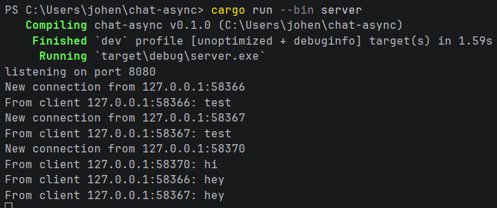
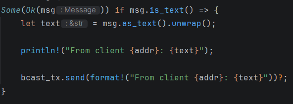
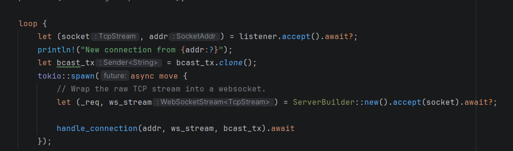

## 2.1 Original code, and how it run
Program dijalankan dengan satu server dan beberapa client. Ketika salah satu client mengetik pesan, pesan tersebut dikirim ke server melalui websocket. Server kemudian membroadcast pesan itu ke client lain. Karena itu, pesan dari satu client dapat terlihat di client lainnya.

## 2.2 Modifying port
Port harus diubah pada dua sisi, yaitu server dan client. Server menggunakan port untuk membuka koneksi websocket, sedangkan client menggunakan port yang sama untuk terhubung ke server. Jika hanya salah satu yang diubah, koneksi akan gagal karena alamat tujuan tidak sesuai.
## 2.3 Small changes. Add some information to client
Saya sudah menambahkan informasi IP dan port client pada pesan yang dikirim. Informasi ini diambil dari alamat koneksi client ketika server menerima koneksi. Dengan perubahan ini, setiap client dapat mengetahui dari koneksi mana pesan tersebut berasal.

