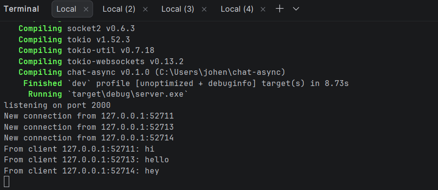
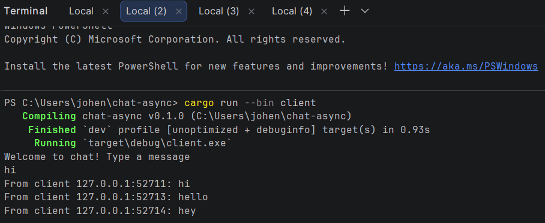
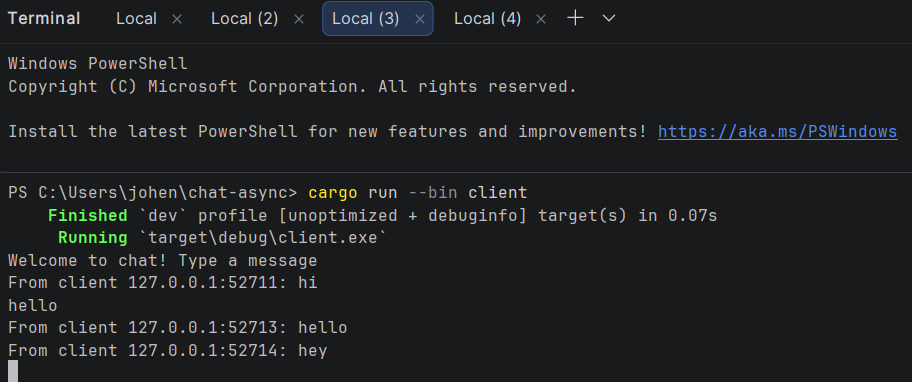
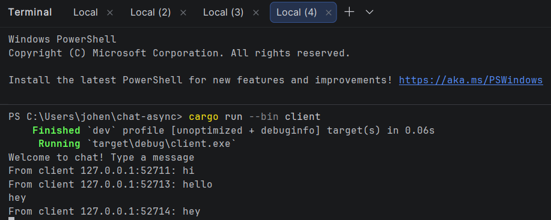

## 2.1 Original code, and how it run
Program dijalankan dengan satu server dan beberapa client. Ketika salah satu client mengetik pesan, pesan tersebut dikirim ke server melalui websocket. Server kemudian membroadcast pesan itu ke client lain. Karena itu, pesan dari satu client dapat terlihat di client lainnya.

